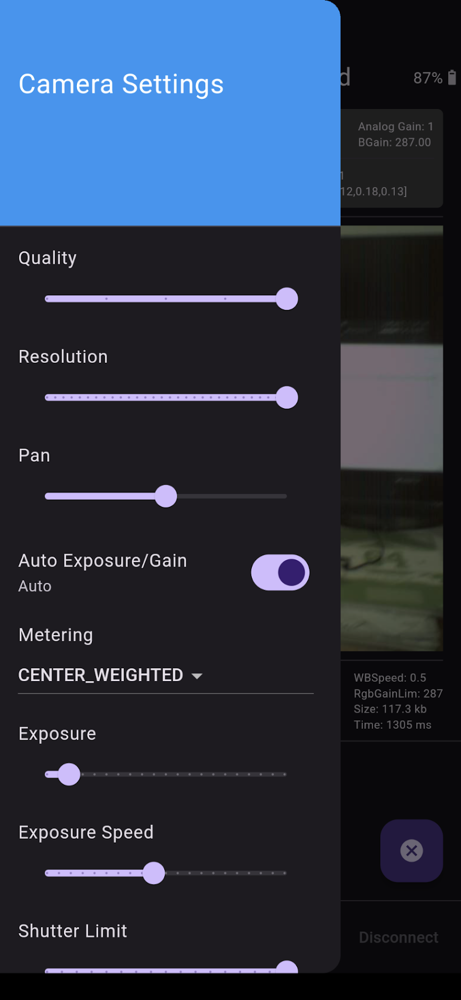

# Frame Live Camera Feed

Live Mobile Camera Feed from the Brilliant Frame.

Camera settings can be adjusted.

### Screenshots

### Architecture

### See Also
- [Frame Camera App](https://github.com/CitizenOneX/frame_flutter_camera)
